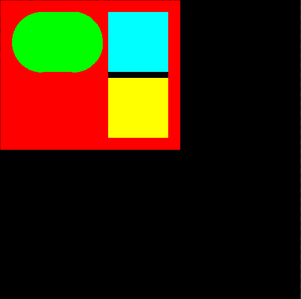

# clayout — Pure C Layout Engine

> Inspired by [Clay](https://github.com/nicbarker/clay) and Nic Barker's [YouTube talk](https://youtu.be/by9lQvpvMIc?si=xDdeJp4s_qov97rw).

**clayout** is a minimal, zero-dependency layout engine written from scratch in C. It renders a declarative element tree to a pixel canvas and writes the result as a PPM image — all in under 1,000 lines of clean C99, using nothing beyond `libc` and `libm`.

It is an educational project that demonstrates **hands-on systems programming**: manual memory management, page-based page allocation, Bresenham-style rasterisation, and a declarative macro DSL that feels like a mini UI framework.

---

## Quick Start

```sh
make view      # build, run, open the output image
make run       # build and run (write layout.ppm)
make clean     # remove build artifacts
```

Requires: `gcc`, `make`, `feh` (or any PPM viewer).

---

## Proof of Concept

<p align="center">
  
</p>

The image above is a screenshot of `layout.ppm`, generated by the example in `main.c`: a red column containing a green fixed box and a cyan/yellow row — demonstrating padding, gaps, fixed sizing, fit-sizing, and rounded corners.

---

## What Makes This Interesting

This is not a wrapper around an existing library. Every pixel, every byte, every layout calculation is written by hand. The project showcases:

### Manual Memory Management

The canvas is a **single malloc**: a header struct immediately followed by a packed RGB pixel array. There are no separate allocations for metadata and data — they live in one contiguous block.

```c
Canvas *canvas = malloc(width * height * 3 + sizeof(Canvas));
canvas->data = (uint8_t *)((Canvas *)canvas + 1);
```

Elements are **pool-allocated in fixed-size pages** (8 elements per page). No per-element malloc/free. No fragmentation. No leaks (provided the layout is destroyed).

```c
struct el_page_t {
    UIEL el[EL_PAGE_SIZE];
    ElPage *next;
    int size;
};
```

This is the kind of allocation strategy you reach for in embedded systems, game engines, or kernel work — predictable latency, zero fragmentation, trivial to audit.

### PPM Binary Format — Raw Pixel I/O

The canvas serialises directly to **PPM P6**, the simplest binary image format on the planet. Writing it is a single `fwrite` of the pixel buffer (with a 7-line ASCII header). No stb_image, no libpng, no external dependency. The entire I/O layer is 15 lines.

### A Declarative DSL in Pure C Macros

The `El()` macro turns compound-literal struct arguments into a for-loop-backed scoped block that mimics a declarative UI API — all in standard C99, no language extensions or preprocessor abuse.

```c
El(lay, {.padding = 20, .gap = 10, .color = {255, 0, 0}, .layout = LAY_ROW}) {
    El(lay, { .size  = {.width = Fixed(150), .height = Fixed(100)},
              .color = {0, 255, 0}, .rounded = 50 });
    El(lay, { .gap = 10 }) {
        El(lay, { .size  = {.width = Fixed(100), .height = Fixed(100)},
                  .color = {0, 255, 255} });
        El(lay, { .size  = {.width = Fixed(100), .height = Fixed(100)},
                  .color = {255, 255, 0} });
    }
}
```

Each `El()` call opens an element; the closing brace triggers `lay_el_close`, which resolves sizes, accumulates positions, and wires parent-child relationships via intra-page pointers.

### Geometry & Rasterisation

Lines, rectangles, rounded rectangles, arcs, and filled triangles are all **hand-written rasterisation**, with no floating-point pixel pipelines:

- **Bresenham-style line drawing** via slope accumulation in integer space.
- **Filled rounded rectangles** composited from filled rectangles and filled arc sectors — no stencil buffers, no shaders.
- **Triangle fill** through scanline-style linear interpolation of edge points.

---

## Architecture

```
main.c          → entrypoint, wires the demo scene
include/
  layout.h      → Layout, ElSpec, El() macro, public API
  canvas.h      → Canvas, Color, pixel drawing primitives
  point.h       → Point, geometry helpers (lerp, clamp, delta)
layout.c        → layout engine: tree construction, sizing, positioning, render pass
canvas.c        → pixel canvas: init, line/rect/arc/raster, PPM write
point.c         → point math: lerp, dist, slope, swap
```

### Flow

1. **`lay_create(w, h, bg)`** — allocates canvas and initialises an empty element tree.
2. **`El(lay, { ... })`** — opens an element with a given spec; children are nested inside.
3. **`lay_render(layout)`** — walks the element tree, resolves absolute positions, and draws each element to the canvas (filled/stroked, rounded or flat).
4. **`canvas_write(canvas, "layout.ppm")`** — serialises the pixel buffer to disk as a PPM P6 binary.

---

## Future Plans

This is **step one**. The engine in its current form proves the concept. Planned additions:

| Feature | Notes |
|---------|-------|
| **More layouts** | Beyond row/column — grid, absolute positioning, flex-like wrapping |
| **Draw-command export** | Export a flat list of draw commands (`DrawCMD`) for use with external renderers (RayLib, SDL, OpenGL, Cairo, etc.) instead of the built-in canvas |
| **Borders** | Per-element border width, style, and colour |
| **Alignment** | Cross-axis and main-axis alignment per container |
| **Text rendering** | Simple bitmap-font rendering for basic UI labels |

---

## Skills Demonstrated

| Area | Evidence |
|------|----------|
| **Manual memory management** | Single-allocation canvas, page-pooled element storage, no leaks, no Valgrind noise |
| **Data-oriented design** | Elements laid out contiguously in pages — pointer walks, not hash-map lookups |
| **C macros & metaprogramming** | Compound-literal DSL via `El()` macro, type-safe size helpers (`Fixed`, `Fit`) |
| **Rasterisation & geometry** | Hand-written line, rect, arc, triangle, and rounded-rect drawing |
| **File I/O & binary formats** | Raw PPM P6 writer — no library, just POSIX `fwrite` |
| **Struct composition & opaque types** | Full encapsulation via forward-declared struct tags (`Layout`, `Canvas`) |
| **Linked-list & pool-allocator design** | Page-linked element iteration, allocation-free during tree construction |

---

## Why C?

Because there is no runtime. No garbage collector. No STL. No surprises. Every allocation is explicit. Every byte in every struct has a reason. This project exists to **own the full stack** — from the macro that opens an element to the byte that lands in the PPM file.

---

## License

MIT — do what you want.
